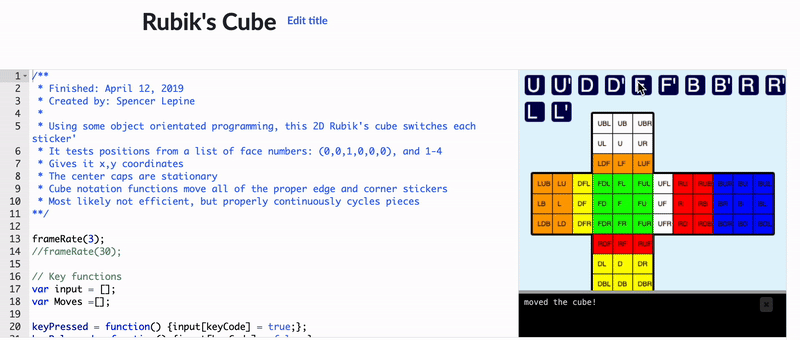

# JavaScript Rubiks Cube

3x3 Rubiks Cube program written in JavaScript. Built for the Khan Academy P5.js library.

Source: https://www.khanacademy.org/computer-programming/rubiks-cube/5294443187044352

